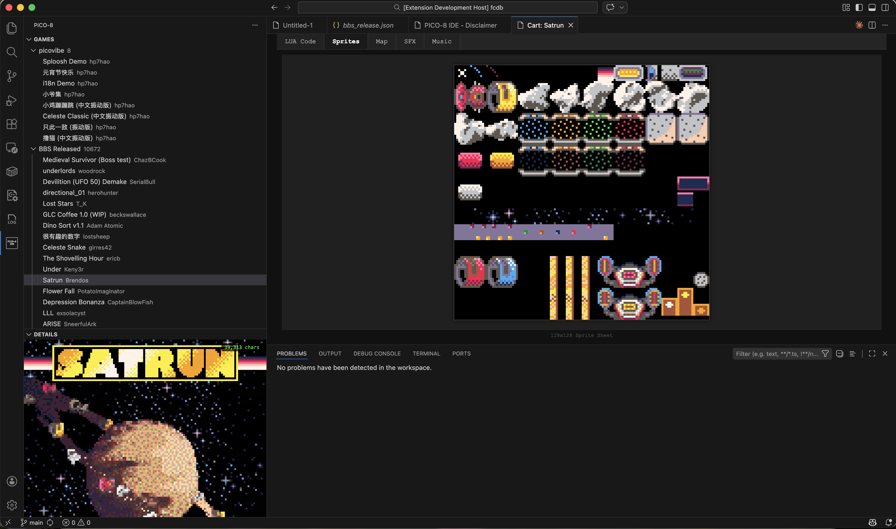

# PICO-8 IDE

[English](README.md) | [中文](README.zh_CN.md)

A VS Code extension for browsing and playing PICO-8 games.



> **Note:** The extension currently supports viewing cartridge data only (code, sprites, maps, SFX, music). Editing and running games is coming soon.

## Features

- Browse PICO-8 games from the [Lexaloffle BBS](https://www.lexaloffle.com/bbs/?cat=7)
- Search games by name, author, or game ID
- View game details, thumbnails, and metadata
- Open and read PICO-8 cartridge source code
- View sprites, maps, SFX, and music data
- Curated game lists

## Usage

After installing, click the PICO-8 icon in the Activity Bar to open the game browser. Games are loaded from a regularly updated database.

## Create Your Own Game List

The extension supports curated game lists powered by the [fcdb](https://github.com/hp7hao/fcdb) project. You can create your own list and contribute it to the database.

Add a JSON file to `fcdb/curated/pico8/lists/` with any name (e.g. `mylist.json`). Four formats are supported:

### Format 1 — Simple array

A plain array of game ID strings and/or inline game objects:

```json
[
  "131736",
  {
    "id": "my_custom_game",
    "name": "My Game",
    "source": "custom",
    "author": { "name": "yourname" },
    "description": "A cool PICO-8 game.",
    "created": "2025-01-01 00:00:00",
    "updated": "2025-01-01 00:00:00",
    "extension": {
      "cart_url": "https://example.com/mygame.p8.png",
      "tags": ["platformer"]
    }
  }
]
```

### Format 2 — Structured games list

A named list with metadata and an array of game IDs or inline objects:

```json
{
  "meta": { "name": "My List", "description": "A hand-picked collection.", "order": 1 },
  "games": ["131736", "54321"]
}
```

### Format 3 — Keyword filter

Automatically matches games by name or tags:

```json
{
  "meta": { "name": "Puzzle Games", "description": "Games tagged or named with puzzle." },
  "filter": { "keyword": "puzzle" }
}
```

### Format 4 — Ranked list

Sorts games by a numeric field and takes the top N:

```json
{
  "meta": { "name": "BBS Fan Favorites", "description": "Top 100 most liked games on the BBS.", "order": 5 },
  "rank": { "field": "likes", "order": "desc", "limit": 100 }
}
```

### Required fields for inline games

| Field | Description |
|-------|-------------|
| `id` | Unique identifier for the game |
| `name` | Display name |
| `author.name` | Author name |
| `created` | Creation date (`YYYY-MM-DD HH:MM:SS`) |
| `updated` | Last update date (`YYYY-MM-DD HH:MM:SS`) |

Optional fields: `source` (defaults to `"custom"`), `description`, `license`, `ref_id`, and `extension` (for `cart_url`, `tags`, etc.)

### Translations

Add a companion file named `{listname}.{lang}.json` (e.g. `mylist.zh_CN.json`) to provide translated metadata:

```json
{
  "meta": { "name": "My List in Chinese", "description": "..." }
}
```

### Build the database

```bash
cd fcdbtool
npm run build && npm run db:pico8
```

The build pipeline will:
- Add inline games to the master database
- Download cartridges from `cart_url` if provided
- Generate thumbnails automatically
- Output the list view to `fcdb/dist/pico8/lists/yourlist.json`

## Disclaimer

This is a hobby project for learning purposes only. Not for sale and not affiliated with Lexaloffle Games.

If you're interested in PICO-8, please visit the official website: https://www.lexaloffle.com/pico-8.php

## License

MIT
